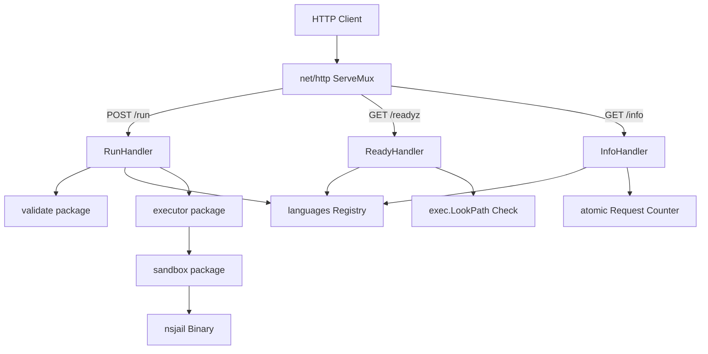

# System Architecture (Stage 2)

This document describes the internal structure, component design, and execution lifecycle of the **goboxd** sandbox service.

---

## 1. Component Architecture & Route Lifecycles

The service consists of three core HTTP endpoints, wired through a centralized mapping registry and validator:



### Request Lifecycles:

#### POST /run (Code Execution)
1. **Validation:** The HTTP request body is capped at 256 KiB. The `validate` package checks sizes, asserts test count limits (max 50), rejects path traversal filename patterns (`..`, `/`), and validates flags against the allow-list.
2. **Registry Lookup:** Resolves the compilation and execution commands, default limits, and strategy flags for the specified language.
3. **Execution Pipeline:** An ephemeral directory is created atomically using `os.MkdirTemp`. User code is written to this folder.
   * **Compilation:** For compiled languages (`c`, `cpp`, `java`, `verilog`), the compiler executes under `nsjail` inside the workspace. If compilation fails, the executor returns `build_failed` and skips tests.
   * **Test Run Loop:** Runs the compiled binary (or interpreter command) against each test case inside `nsjail`. Replaces placeholders (`{{source}}`, `{{artifact}}`, `{{flags}}`) dynamically.
4. **Metrics Tracking:** Increments the global atomic processed requests counter upon successful output parsing.
5. **Garbage Collection:** A deferred cleanup sweeps and deletes the temporary directory and all user workspace artifacts.

#### GET /readyz (Readiness Check)
To avoid high monitoring overhead, the `ReadyHandler` runs an assertion suite once upon server startup, caching the outcome:
1. Verifies that the `nsjail` executable is present on the path.
2. Loops through all registered language profiles and checks if their compiler or interpreter binaries exist using `exec.LookPath`.
3. Runs a command-line probe check (e.g. `javac -version`) to verify that the environment can start the runtime process without resource issues.
4. If any runtime fails to resolve or throws an execution error, the endpoint responds with `503 Service Unavailable` detailing the degraded dependencies. If all checks succeed, it returns `200 OK`.

#### GET /info (Server Diagnostic metadata)
Exposes active configuration constraints and live telemetry:
1. Returns the server-wide limits enforced by the validator.
2. Fetches and serializes all registered language configurations directly from the language registry.
3. Performs a thread-safe read (`atomic.LoadUint64`) of the total execution runs processed since the server boot sequence.

---

## 2. Directory & Package Structure

```
goboxd/
├── cmd/
│   └── goboxd/
│       └── main.go              # Service entry point; bootstraps configuration, counters, & routes
├── internal/
│   ├── handler/
│   │   ├── handler.go           # POST /run execution handler
│   │   ├── ready.go             # GET /readyz startup health probe check
│   │   └── info.go              # GET /info configurations & stats check
│   ├── validate/
│   │   └── validate.go          # Filename checks, sizes, and flag validations
│   ├── languages/
│   │   ├── config.go            # Language struct definitions (with yaml & json mapping tags)
│   │   └── registry.go          # Configuration loading and maps cache registry
│   ├── executor/
│   │   └── executor.go          # Multi-stage sandboxed compiler & execution run loop
│   ├── sandbox/
│   │   └── nsjail.go            # nsjail parameter generator
│   └── model/
│       ├── request.go           # JSON request structures
│       └── response.go          # JSON response structures
└── configs/
    └── languages/
        └── languages.yaml       # Declarative runtime specifications
```

---

## 3. Key Design Decisions

### Headless Sandboxed VMs Memory Isolation
Java JVM and Node.js require massive virtual address space reservation at startup on 64-bit systems. Enforcing tight address space limits (`--rlimit_as` under nsjail) causes VM initialization crashes.

We resolve this by combining two techniques:
1. **Raising Address Space limits:** Setting memory limits for Java and Node.js execution runs to 1 GB.
2. **Restricting Internal Heap & GC Pools:** Disabling heavy garbage collection defaults (`-XX:+UseSerialGC`) and JIT footprint optimization (`-XX:TieredStopAtLevel=1`), alongside specifying small heap allocations (`-Xms64m -Xmx128m` for Java, and `--max-old-space-size=128` for JavaScript). This keeps the actual RSS (physical memory) footprint low while letting the VMs boot successfully inside their sandboxed allocations.
