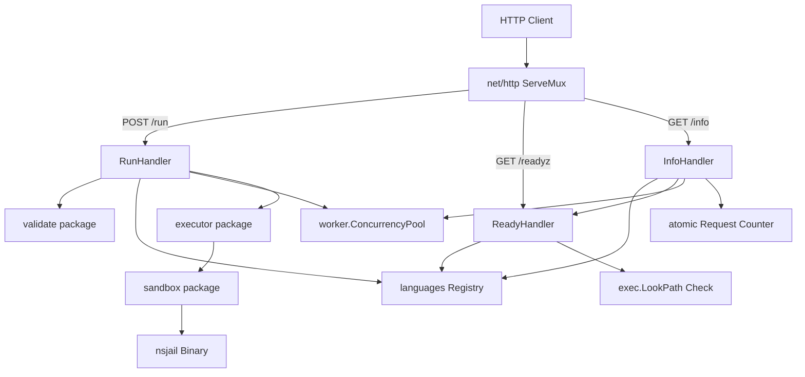

# System Architecture (Stage 3)

This document describes the internal structure, component design, and execution lifecycle of the **goboxd** sandbox service.

---

## 1. Component Architecture & Route Lifecycles

The service consists of three core HTTP endpoints, wired through a centralized mapping registry, validator, and concurrency scheduler:



### Request Lifecycles:

#### POST /run (Code Execution)
1. **Validation & Clamping:** The HTTP request body is capped at 256 KiB. The `validate` package checks sizes, test bounds, and filenames. Per-request resource limits are dynamically validated and **clamped** instead of rejected:
   * **Java/JS Min Memory:** Enforces a minimum of 1 GB memory mapping to prevent runtime boot crashes.
   * **C/C++ Build Min Memory:** Enforces a minimum of 256 MB.
   * **Load-Adaptive Upper Caps:** If the sliding window request rate exceeds 5 req/sec, maximum resource caps (memory, wall time) are dynamically scaled down to protect the host.
   * **Warnings:** Clamped adjustments are logged and returned in the `warnings` array.
2. **Registry Lookup:** Resolves the compilation and execution commands, default limits, and strategy flags for the specified language.
3. **Concurrency Acquisition:** The request attempts to acquire a slot in the `worker.ConcurrencyPool`.
   * If the pool is saturated (15 active slots + 500 queue slots are full), it rejects the request immediately with `503 Service Unavailable` and a dynamic `Retry-After` estimation header.
   * If slots are full but the queue is not, the request is placed in a **Min-Heap Priority Queue** ordered by job cost (wall time and memory requested) with wait-time aging to prevent starvation.
4. **Execution Pipeline:** An ephemeral directory is created using `os.MkdirTemp`.
   * **Compilation:** For compiled languages, compiles inside the sandbox using `nsjail`.
   * **Test Run Loop:** Runs the code inside `nsjail` against each test case sequentially.
5. **Garbage Collection & Release:** The temporary directory is deleted, and the concurrency slot is released, triggering a queue re-heapify and scheduling the next job.

#### GET /readyz (Readiness Check)
The `ReadyHandler` runs an assertion suite once upon server startup, caching the outcome:
1. Verifies that `nsjail` is present.
2. Resolves each language's compiler/runtime path.
3. Runs dynamic version commands (e.g. `python3 --version`) to verify baseline execution.
4. Serves cached status: `200 OK` or `503 Service Unavailable`.

#### GET /info (Server Diagnostic metadata)
Exposes active configuration constraints and live telemetry:
1. Returns limits: max source size, max tests, max concurrent jobs (15), and max queue size (500).
2. Lists registered languages and their cached versions (populated from `ReadyHandler`).
3. Stats tracking: returns `in_flight_jobs`, `queued_jobs`, `jobs_total`, `jobs_failed_internal`, `jobs_shed_total`, `last_internal_error_at`, and free space in the jail temp folder.

---

## 2. Directory & Package Structure

```
goboxd/
├── cmd/
│   └── goboxd/
│       └── main.go              # Service entry point; graceful shutdown signal loop & pool bootstrap
├── internal/
│   ├── handler/
│   │   ├── handler.go           # POST /run execution handler
│   │   ├── ready.go             # GET /readyz health check & version prober
│   │   └── info.go              # GET /info configurations, saturation metrics, & stats check
│   ├── worker/
│   │   └── pool.go              # Priority queue (Min-Heap), RateTracker, and ExecutionTracker
│   ├── validate/
│   │   └── validate.go          # Filename, size, flags, and load-adaptive resource limits clamping
│   ├── languages/
│   │   ├── config.go            # Language struct definitions
│   │   └── registry.go          # Registry cache registry
│   ├── executor/
│   │   └── executor.go          # Sandboxed compiler & execution run loop
│   ├── sandbox/
│   │   └── nsjail.go            # nsjail parameter generator
│   └── model/
│       ├── request.go           # JSON request structures
│       └── response.go          # JSON response structures
└── configs/
    └── languages/
        └── languages.yaml       # Declarative runtime specifications
```

---

## 3. Key Design Decisions

### Nested Container Namespace Hardening & UID Isolation
Under concurrent load, running sandboxes under identical UIDs poses security risks. We resolved this by assigning a process-unique UID to each execution via an atomic counter and PID mapping.
Furthermore, we hardened the Docker boundary by removing `privileged: true` from the container configuration. Because Docker mounts masked paths over `/proc` inside standard containers for security, nested mount namespaces fail to mount a new `procfs` without host-level privileges. We bypassed this by disabling `procfs` mounting inside the jail (`--disable_proc`), enabling `nsjail` to run with unprivileged user namespaces under the narrow `SYS_ADMIN` capability.

### Headless Sandboxed VMs Memory Isolation
Java JVM and Node.js require massive virtual address space reservation at startup on 64-bit systems. Enforcing tight address space limits (`--rlimit_as` under nsjail) causes VM initialization crashes.
We resolve this by:
1. Enforcing a minimum override floor of 1 GB memory limit for Java and JS runs.
2. Restricting internal physical heap size via command line args (`-Xmx128m` and `--max-old-space-size=128`). This maps virtual memory to satisfy VM boot while keeping actual physical RAM usage under ~40-50MB.

### Shortest Job First (SJF) Scheduling with Starvation Aging
Under heavy load, processing long-running or high-memory jobs first creates queue head-of-line blocking. We utilize a Min-Heap sorted by expected cost. To prevent heavy requests from starving indefinitely, we subtract an aging factor of `2.0 * wait_time_seconds` from the priority score, ensuring all requests eventually get scheduled.

### Load-Adaptive Limit Clamping
To survive massive spikes, the validator monitors request rate over a sliding 10-second window. Above 5 req/sec, the maximum allowed overrides are progressively clamped down, forcing heavy requests to use smaller, safer runtime boundaries and protecting the host from OOM.
