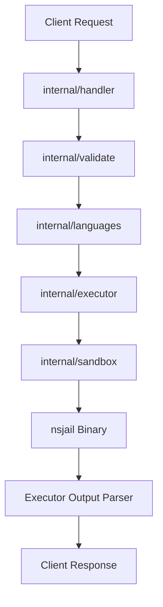

# System Architecture (Stage 1)

This document describes the internal structure, component design, and execution lifecycle of the **goboxd** sandbox service.

---

## 1. Request Lifecycle & Data Flow

When a client submits a code execution request via `POST /run`, it traverses the packages in the following sequence:



### Flow Breakdown:
1. **HTTP Handler (`internal/handler`)**: Captures the request, caps the read body to 256 KiB, and decodes the JSON payload into a Go struct.
2. **Validator (`internal/validate`)**: Enforces path sanitization, size limits, test case count limits, and checks flags against configured allow-lists to prevent shell injection or resource exhaustion.
3. **Registry (`internal/languages`)**: Resolves the target language configuration from `configs/languages/languages.yaml` (determining if it is interpreted or compiled, and fetch default limits).
4. **Executor (`internal/executor`)**: Wires up the runtime workspace. It creates a temporary directory using `os.MkdirTemp` and writes the code to disk.
5. **Sandbox (`internal/sandbox`)**: Builds the execution environment cmd using `nsjail` CLI parameters, specifying chroot limits, mounting bindings, and memory/process restrictions.
6. **Execution (`nsjail`)**: The process runs isolated from the host. If compilation is required (e.g. for C), it executes compilation first, then runs test cases against the binary.
7. **Cleanup**: A deferred garbage collector runs to sweep and remove the temporary directories.

---

## 2. Directory & Package Structure

```
goboxd/
├── cmd/
│   └── goboxd/
│       └── main.go              # Service entry point; bootstraps configuration & routes
├── internal/
│   ├── handler/
│   │   └── handler.go           # HTTP routing & parsing (GET /healthz, POST /run)
│   ├── validate/
│   │   └── validate.go          # Filename checks, sizes, and flag validations
│   ├── languages/
│   │   ├── config.go            # Registry structures
│   │   └── registry.go          # Config loader and language maps
│   ├── executor/
│   │   └── executor.go          # Filesystem mounts, compilation, output comparisons
│   ├── sandbox/
│   │   └── nsjail.go            # nsjail parameter generator
│   └── model/
│       ├── request.go           # JSON request structures
│       └── response.go          # JSON response structures
└── configs/
    └── languages/
        └── languages.yaml       # Declarative runtime definition file
```

---

## 3. Key Design Decisions

### Writable Workspaces via `tmpfs`
Because compiling languages like C requires writing files (object files, assemblies, and outputs), but our system mounts the host filesystem `/` as read-only (`--chroot /`), we bind a writable `tmpfs` at `/tmp` (`--tmpfsmount /tmp`). This ensures standard libraries and compilers function correctly without allowing the guest sandbox to write to host mounts.

### Decoupled Execution Phases
The executor handles compiled languages differently from interpreted languages by separating compilation and execution:
* **Interpretive (e.g., Python):** Runs the runtime command directly on the source file inside `nsjail`.
* **Compiled (e.g., C):** Runs GCC compilation first within the temporary sandbox space. If compilation succeeds (`build.status == "ok"`), the executor iterates through test cases, launching the compiled artifact in the runner sandbox. If compilation fails, the executor skips all test runs and returns `build_failed`.
